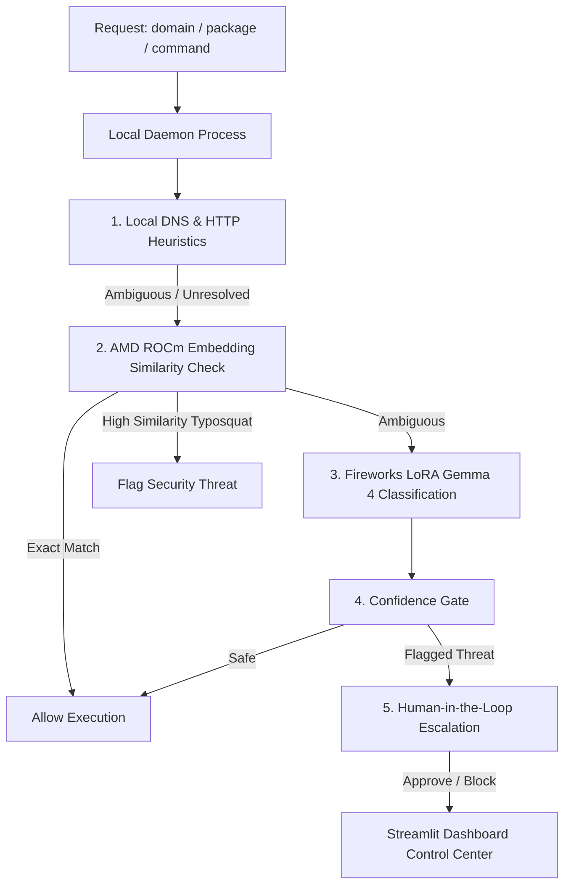

# 🛡️ PhantomGuard: Your AI Agent's Trust Firewall

PhantomGuard is a real-time trust firewall and security interceptor designed to prevent autonomous AI coding agents (such as Claude Code, Codex, Aider) from executing hallucinated instructions. It actively blocks supply-chain threats including **Phantom Squatting** (hallucinated domain hijacks) and **Slopsquatting** (hallucinated package registry takeovers) using a hybrid, two-stage evaluation pipeline.

---

## 🔍 Problem Context & The PhantomGuard Advantage

### The Threat: Phantom Squatting & Slopsquatting
Large Language Models (LLMs) used by AI coding agents are highly prone to hallucinating external resources under low temperature or out-of-distribution prompts. 
- **Phantom Squatting**: An agent hallucinates a brand-adjacent URL (e.g. `docs.github-extra-workflows.org`) to fetch setup files. Attackers monitor agent behavior or public logs, register the domain, and deploy malicious payloads.
- **Slopsquatting (Package Hallucination)**: An agent attempts to install a non-existent package (e.g. `pip install requests-url-helper`). Threat actors pre-emptively upload malware under common hallucinated package names to PyPI or npm registries.

### Why Traditional Mitigations Fail (Palo Alto Unit 42)
Security researchers, such as Palo Alto's Unit 42, recommend three standard mitigations for package hallucinations:
1. **Manual Reviews**: Developers must manually check every import and URL written by the LLM.
2. **Post-Generation SAST Scans**: Scanning code for unregistered dependencies *after* the generation finishes.
3. **Strict Registry Pinning**: Restricting package managers to strict internal allowed lists.

While effective for static code generation, **these mitigations break down completely in autonomous agent workflows**:
- **Agents Execute Live**: Autonomous agents (like Claude Code or Aider) run shell commands, fetch documentation URLs, and install dependencies *at runtime inside their reasoning loop*. They execute these actions *before* a developer has a chance to review the code.
- **Velocity Bottlenecks**: Manual reviews and strict pinning destroy the speed and fluidity of using AI coding assistants.

### The PhantomGuard Solution
PhantomGuard moves the security boundary from **static scanning to real-time dynamic interception**:
- **Zero-Trust Runtime Interception**: Intercepts outgoing requests *at the network proxy level* and *shell execution level* before they execute, halting malicious actions instantly.
- **Intelligent Typosquat Defense**: Instead of flat allowed lists that block safe new libraries, PhantomGuard uses embedding similarity models (ROCm) and custom fine-tuned classifiers (Fireworks Gemma 4) to dynamically separate legitimate packages from brand-adjacent squats.
- **Developer-First HITL**: Automatically allows safe dependencies while cleanly escalating suspicious threats to a Streamlit control center for manual override, preserving agent velocity.

---

## 🏗️ Reorganized Directory Structure

To deliver a product-oriented submission for Track 3, the workspace is split into two clean workspaces:

*   **`demo_app/`**: Scaffolding for local development, SFT training datasets, logs, FastAPI proxy server, and the Streamlit monitoring dashboard.
*   **`phantomguard_package/`**: The core product—a standalone, publishable Python SDK (`phantomguard-firewall`) featuring a daemon orchestrator, network MITM proxy, surgical CLI hooks, and the AMD ROCm Jupyter notebook server code.

---

## 🛡️ Hybrid Decision Pipeline (AMD ROCm + Fireworks SFT)

To satisfy the AMD compute requirement in a legitimate, load-bearing fashion, PhantomGuard uses a multi-stage verification pipeline:



### The 5-Stage Verification Logic
1.  **Local Heuristics (Stage 1)**: Performs immediate active DNS lookups and HTTP `HEAD` checks. Broken HTTP links (like HTTP 404s) are instantly flagged as usability issues, saving LLM calls.
2.  **AMD ROCm Similarity (Stage 2)**: Runs inside your Jupyter Notebook on AMD hardware, hosting a sentence-transformer model (`all-MiniLM-L6-v2`) to calculate semantic distance.
    *   **Typosquat Interception**: If a typosquatted domain (e.g. `github-extra-workflows.org`) is requested, the server calculates a high similarity match to the safe brand (`github.com`) but not an exact match, triggering a typosquat security block.
    *   **Exact Match Bypass**: Exact brand matches bypass the heavy LLM entirely, saving latency.
    *   **Resilient Fallback**: Bypasses the ROCm server after a **2.0s timeout** to prevent notebook downtime from halting developer workflows.
3.  **Fireworks Gemma 4 SFT (Stage 3)**: Deep semantic reasoning utilizing a LoRA adapter fine-tuned on Google's **Gemma-4-26B (a4b) MoE** model.
    *   **Serverless Fallback**: If the PEFT adapter is offline (since LoRA adapters require active paid deployments on Fireworks), the verifier automatically fails over to the online model **`accounts/fireworks/models/deepseek-v4-pro`** to execute the few-shot classifier template.
4.  **Trust Trace Tagging (Stage 4)**: Every request is logged and tagged with its resolving compute backend: `local`, `amd_notebook_rocm`, `fireworks_lora`, `gemma4_fewshot`, or `human_in_the_loop`.
5.  **Human-in-the-Loop Review (Stage 5)**: Intercepted threats pause the agent process and await manual override on the Streamlit control dashboard, defaulting to block (fail-secure) after a 60-second timeout.

### ☁️ Production Engine: Fireworks AI API Integration
The primary, fully tested production backend of PhantomGuard relies on the **Fireworks AI Serverless API** to achieve high accuracy and minimal latency:
- **Custom SFT Gemma 4 Classifier**: Evaluates agent request semantics using a LoRA-adapted Gemma-4-26B MoE model to discern security threats from clean commands.
- **Failover Base Model**: If the custom adapter is offline, the verifier automatically falls back tofew-shot prompt templates on the `deepseek-v4-pro` model, guaranteeing zero downtime.

### 🧪 Experimental: Local AMD ROCm Compute Integration
To support completely offline developer environments, this repository also contains **early-stage, untested implementations** designed to run AI workloads locally on AMD GPUs using **ROCm**:
- **Local Semantic Distance Server**: A prototype Flask server ([embed_server.py](file:///c:/Users/19295/PhantomGuard/phantomguard_package/phantomguard/notebooks/embed_server.py)) running inside a Jupyter Notebook. It loads `all-MiniLM-L6-v2` onto an AMD GPU to calculate cosine similarity distance against a safe brand corpus (`SAFE_CORPUS`) for typosquatting interception.
- **Local SFT Model Training**: A script ([train_rocm.py](file:///c:/Users/19295/PhantomGuard/demo_app/scripts/train_rocm.py)) demonstrating how to load and fine-tune Gemma base models locally using ROCm-compiled PyTorch, 4-bit quantization (`bitsandbytes`), and Hugging Face's `SFTTrainer`.

---

## 🚀 Setup & Execution Guide

### ☁️ Production Flow: Using Fireworks Cloud API (Primary Setup)

This flow runs the local code repository and routes all deep-reasoning verification steps to the hosted SFT/DeepSeek model on Fireworks AI.

#### 1. Setup & Installation
1. Clone the repository and navigate to the project directory:
   ```bash
   git clone https://github.com/nafizzl/PhantomGuard.git
   cd PhantomGuard
   ```
2. Create a `.env` file in the project root containing your Fireworks credentials:
   ```env
   FIREWORKS_API_KEY="your-fireworks-api-key"
   ```
3. Install the package in editable mode:
   ```bash
   pip install -e phantomguard_package
   ```

#### 2. Running the Live Interception Demo
1. Run the demo services launcher inside the `demo_app` folder:
   ```bash
   cd demo_app
   .\run_demo.bat
   ```
   *(This script automatically installs frontend/backend dependencies, starts the FastAPI daemon on port 8000, and launches the Streamlit control dashboard).*
   
2. In a separate terminal, launch the simulated coding agent:
   ```bash
   python demo_app/scripts/simulate_agent.py
   ```

#### 3. Real-World AI CLI Agent Integration (Aider / Claude Code)
You can also run your actual preferred coding agents inside the secured proxy environment:
1. Initialize the workspace:
   ```bash
   phantomguard init
   ```
   *(This creates a local `.env` configuration template and a `phantomguard_hook.bat` PreToolUse validator batch file).*
2. Spin up the background daemon:
   ```bash
   phantomguard start
   ```
3. Securely start coding normally with your agent CLI:
   - **Option A (Environment Proxy)**: Run the agent command wrapped in the proxy:
     ```bash
     phantomguard run "claude"
     ```
   - **Option B (Surgical Hook)**: Configure `phantomguard_hook.bat` as a `PreToolUse` validator in your agent's config (e.g., Aider, Claude Code, or Cursor) to block hallucinated URLs/packages before execution.

---

### 🧪 Experimental Flow: Local AMD ROCm GPU Setup (Optional)

This flow runs the Stage 2 embedding similarity server locally inside a Jupyter Notebook on an AMD ROCm-powered GPU.

#### 1. Remote (ROCm Jupyter Notebook Server)
1. Paste and run the cell containing **`phantomguard_package/phantomguard/notebooks/embed_server.py`** (this runs a Flask server on port `5000` mapped to `DEVICE = "cuda"` for ROCm).
2. Open a tunnel in the notebook terminal:
   ```bash
   ngrok http 5000
   ```
   *Copy the generated `https` ngrok URL.*

#### 2. Local Configuration
1. In your local workspace root `.env` file, add the ngrok URL:
   ```env
   AMD_NOTEBOOK_URL="https://xxxx.ngrok-free.app"
   ```
2. Restart the daemon services. All requests will now run through the local similarity server first for typosquatting checks before falling back to the cloud LLM.

