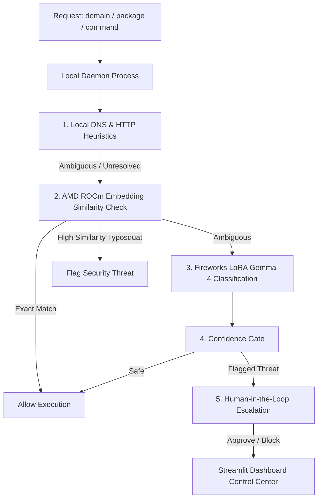

# 🛡️ PhantomGuard: Trust Trace Agent Firewall

PhantomGuard is a real-time trust firewall and security interceptor designed to prevent autonomous AI coding agents (such as Claude Code, Codex, Aider) from executing hallucinated instructions. It actively blocks supply-chain threats including **Phantom Squatting** (hallucinated domain hijacks) and **Slopsquatting** (hallucinated package registry takeovers) using a hybrid, two-stage evaluation pipeline.

---

## 🏗️ Reorganized Directory Structure

To deliver a product-oriented submission for Track 3, the workspace is split into two clean workspaces:

*   **`demo_app/`**: Scaffolding for local development, SFT training datasets, logs, FastAPI proxy server, and the Streamlit monitoring dashboard.
*   **`phantomguard_package/`**: The core product—a standalone, publishable Python SDK (`phantomguard-firewall`) featuring a daemon orchestrator, network MITM proxy, surgical CLI hooks, and the AMD ROCm Jupyter notebook server code.

---

## 🛡️ Hybrid Decision Pipeline (AMD ROCm + Fireworks SFT)

To satisfy the AMD compute requirement in a legitimate, load-bearing fashion, PhantomGuard uses a multi-stage verification pipeline:



### The 5-Stage Verification Logic
1.  **Local Heuristics (Stage 1)**: Performs immediate active DNS lookups and HTTP `HEAD` checks. Broken HTTP links (like HTTP 404s) are instantly flagged as usability issues, saving LLM calls.
2.  **AMD ROCm Similarity (Stage 2)**: Runs inside your Jupyter Notebook on AMD hardware, hosting a sentence-transformer model (`all-MiniLM-L6-v2`) to calculate semantic distance.
    *   **Typosquat Interception**: If a typosquatted domain (e.g. `github-extra-workflows.org`) is requested, the server calculates a high similarity match to the safe brand (`github.com`) but not an exact match, triggering a typosquat security block.
    *   **Exact Match Bypass**: Exact brand matches bypass the heavy LLM entirely, saving latency.
    *   **Resilient Fallback**: Bypasses the ROCm server after a **2.0s timeout** to prevent notebook downtime from halting developer workflows.
3.  **Fireworks Gemma 4 SFT (Stage 3)**: Deep semantic reasoning utilizing a LoRA adapter fine-tuned on Google's **Gemma-4-26B (a4b) MoE** model.
    *   **Serverless Fallback**: If the PEFT adapter is offline (since LoRA adapters require active paid deployments on Fireworks), the verifier automatically fails over to the online model **`accounts/fireworks/models/deepseek-v4-pro`** to execute the few-shot classifier template.
4.  **Trust Trace Tagging (Stage 4)**: Every request is logged and tagged with its resolving compute backend: `local`, `amd_notebook_rocm`, `fireworks_lora`, `gemma4_fewshot`, or `human_in_the_loop`.
5.  **Human-in-the-Loop Review (Stage 5)**: Intercepted threats pause the agent process and await manual override on the Streamlit control dashboard, defaulting to block (fail-secure) after a 60-second timeout.

---

## 🚀 Setup & Execution Guide

### Flow A: The Hackathon Judge (Local Demo & ROCm Notebook)

This flow runs the local code repository and the provided AMD Jupyter notebook to demonstrate compute execution.

#### 1. Remote (Jupyter Notebook on AMD ROCm)
1. Paste and run the cell containing **`phantomguard_package/phantomguard/notebooks/embed_server.py`** (runs a Flask server on port `5000` using ROCm).
2. Open a tunnel in the notebook terminal:
   ```bash
   ngrok http 5000
   ```
   *Copy the generated `https` address.*

#### 2. Local Setup
1. Clone the repository and navigate to the project directory:
   ```bash
   cd PhantomGuard
   ```
2. Create a `.env` file under `demo_app/` and your workspace containing:
   ```env
   FIREWORKS_API_KEY="your-fireworks-api-key"
   AMD_NOTEBOOK_URL="https://xxxx.ngrok-free.app"
   ```
3. Install the package in editable mode:
   ```bash
   cd phantomguard_package
   pip install -e .
   ```
4. Bootstrap your project workspace folder:
   ```bash
   phantomguard init
   ```

#### 3. Running the Live Interception
1. Start the daemon (orchestrator on port `8001` and proxy on port `8000`):
   ```bash
   phantomguard start
   ```
2. Launch the Streamlit dashboard in a separate terminal:
   ```bash
   streamlit run demo_app/frontend/dashboard.py
   ```
3. Start the simulated agent script:
   ```bash
   python demo_app/scripts/simulate_agent.py
   ```
4. Observe the live logs in the dashboard. Try approving/rejecting the paused actions in the UI, and notice how the simulated agent's process thread is paused/unblocked in real time!

---

### Flow B: The Outside Product User (The Final SaaS Product)

This is the commercial flow where the user does not need to manage any notebooks or local server instances.

#### 1. Installation
The user simply installs the published package from PyPI into their coding environment:
```bash
pip install phantomguard-firewall
```

#### 2. Workspace Initialization
1. In their coding directory, the user runs:
   ```bash
   phantomguard init
   ```
   This automatically hooks the local shell environment and configures the `PreToolUse` validation hook inside Claude Code/Aider.
2. They add their Fireworks API Key to the generated `.env` file:
   ```env
   FIREWORKS_API_KEY="fw_..."
   ```

#### 3. Start Coding
The user starts coding normally with their preferred AI CLI:
```bash
claude
```
- When Claude Code attempts to run a shell command or fetch a URL, the local wrapper intercepts it silently in the background, checks it against our hosted cloud firewall, and prompts the user in the terminal or on their tray bar only if a security risk is detected.
